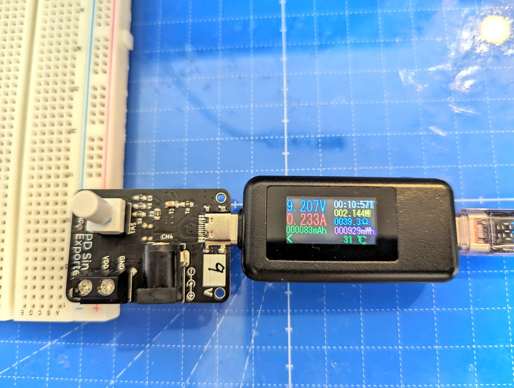

# USB PD Exporter

Adapter to extract 5, 9, 12, and 20V power using CH214K, a USB PD Sink controller.

USB PD Sink コントローラである CH214K を使って、5, 9, 12, 20V 電源を取り出すアダプター。

## features

- Output voltage can be changed.
- Can be plugged directly into a breadboard.
- Power on/off switch.

### Japanese

- 出力電圧を変更することができる。
- ブレッドボードに直接挿すことができる。
- 電源のオンオフボタンがある。

## documents

### v1.0.1

- Semantics [PDF](./documents/v1.0.1/schematic.pdf) [kicanvas](https://kicanvas.org/?github=https%3A%2F%2Fgithub.com%2F74th%2Fusb-pd-exporter%2Fblob%2F1.0.1%2Fusb_pd_exporter.kicad_sch)
- PCB [kicanvas](https://kicanvas.org/?github=https%3A%2F%2Fgithub.com%2F74th%2Fusb-pd-exporter%2Fblob%2F1.0.1%2Fusb_pd_exporter.kicad_pcb)

#### BOM

| Reference | Name                                     | Quantity |
| --------- | ---------------------------------------- | -------- |
| C1, C2    | Capacitor 0805 1uF                       | 2        |
| R1, R4    | Register 0805 1kΩ                        | 2        |
| R2, R5    | Register 0805 10kΩ                       | 2        |
| R3        | Register 0805 100kΩ                      | 1        |
| CH1       | Terminal Block 2P 5.08mm                 | 1        |
| CH2, CH3  | Pin Header 2 Pith 2.54mm                 | 2        |
| CH4       | DC Barrel Jack                           | 1        |
| J1        | USB Type-C Receptacle - USB-C 2.0 Female | 1        |
| JP1       | Jumper CFG1                              | 1        |
| JP2       | Jumper CFG3                              | 1        |
| JP3       | Jumper CFG2                              | 1        |
| Q1        | Pch Dual MOSFET SOIC-8 FDS4935A          | 1        |
| SW1       | Locking Switch                           | 1        |
| U1        | USB PD Sink IC ESSOP-10 CH224K           | 1        |
